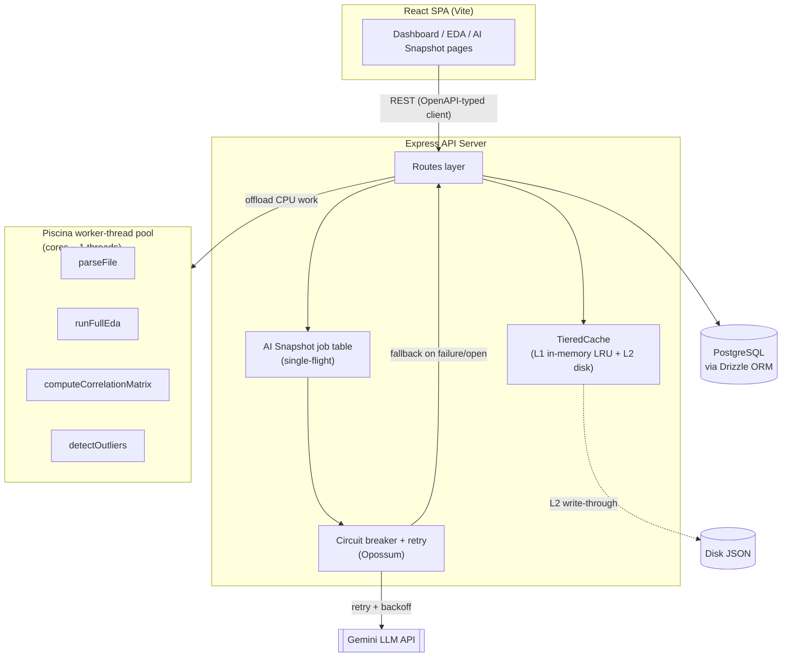

# DataCanvas — System Design Case Study

A full-stack analytics platform: upload a CSV/XLSX, get back statistical
EDA, correlation analysis, outlier detection, and an AI-generated executive
summary — architected for concurrent load and a flaky third-party AI
dependency, not just a happy-path demo.

**Stack:** TypeScript · React · Express · PostgreSQL (Drizzle ORM) · Piscina
(worker threads) · Opossum (circuit breaker) · OpenAPI + Orval codegen ·
pnpm monorepo (8 workspace packages)

---

## Problem Statement

Analysts and data scientists routinely need to go from a raw file to a
usable set of statistics and insights, and the naive version of that tool
— parse on request, compute on request, call an LLM on request — breaks
down under three real conditions:

1. **CPU-bound work is heavy.** Full EDA (per-column stats, correlation
   matrix, IQR outlier scan) on a large file is real, synchronous CPU time.
2. **The AI layer is a third-party dependency you don't control.** It can
   be slow, rate-limited, or down, and a request-response API design
   inherits that unreliability directly.
3. **Concurrency is the default, not the exception.** Multiple users (or
   one user with multiple open tabs) will legitimately request the same
   not-yet-computed resource at the same time.

The goal was a system that stays fast and correct under all three, not
just on a single-user local demo.

---

## System Overview & Architecture

**Key architectural choices:**
- **Contract-first API.** One OpenAPI spec is the source of truth; Orval
  codegen produces both the server-side Zod validators and the typed React
  Query client, so the 8 packages in the monorepo can't drift out of sync.
- **Compute isolation.** All CPU-bound work runs in a bounded worker-thread
  pool, never on the thread handling HTTP connections.
- **Async-first for anything with external latency.** The one route that
  calls a third-party API (AI Snapshot) is designed as a background job
  with client-side polling, not a long-held HTTP request.

---

## Screenshots

*(Add these once captured — recommended shots below)*

| Screenshot | What it should show |
|---|---|
| `dashboard.png` | 

t |
| `eda-explorer.png` | |
| `correlation-matrix.png` |  |
| `ai-snapshot.png` |  |

---

## Key Decisions & Tradeoffs

| Decision | Alternative considered | Why this choice |
|---|---|---|
| Async job + polling for AI Snapshot | Hold the HTTP request open until the LLM responds | A held request has no recovery path if the connection drops mid-wait; polling makes the in-progress state a first-class, resumable thing a client can reconnect to |
| In-process job table + LRU/disk cache | Redis from day one | Single-instance deployment doesn't need distributed state yet; both are built behind small interfaces (`TieredCache`, the jobs map) specifically so the swap to Redis/S3 is localized, not a rewrite |
| Bounded worker-thread pool (Piscina) | Spawn a fresh worker per request, or run inline | A persistent pool amortizes thread-startup cost across requests while still capping total CPU parallelism at cores − 1, so the pool itself can't starve the event loop |
| Circuit breaker + 1 retry, not unlimited retries | Retry until success | Unlimited retries on a sustained outage just relocates the latency problem; a breaker that opens after repeated failures and self-heals via a half-open trial keeps failure cost bounded and constant |
| 200 + status field, not 202 Accepted, for the job endpoint | True REST 202 semantics | Keeps the OpenAPI-generated client's return type single-shaped — the polling logic only branches on the JSON body, not on HTTP status, which is simpler to generate and consume correctly |
| Rate limit only upload + AI Snapshot | Blanket rate limiting on all routes | Those two are the only routes with real per-request cost (disk I/O + worker CPU; a billed external API call) — limiting cheap DB-lookup routes would add overhead for no actual protection |

---

## Why It Matters

- **User-facing latency:** AI Snapshot's initial response time dropped from
  as much as **~25,000ms** (worst case, blocking on the LLM call) to a
  measured **74ms** to acknowledge the request and hand back a job to poll.
- **Failure cost is bounded, not open-ended:** with a deliberately invalid
  API key, the retry-then-fallback path completed in a measured **912ms**
  — the user gets a usable rule-based result in under a second instead of
  waiting out a ~19–25s timeout on every single request during an outage.
- **No duplicate external API spend:** firing 3 concurrent requests at the
  same not-yet-computed dataset resulted in exactly **1** LLM call, not 3 —
  single-flight coalescing turns an O(concurrent users) cost into O(1) per
  resource.
- **Response payload shrank from O(n) to O(1)** for the summary endpoint by
  moving aggregation into a SQL `SUM`/`COUNT` instead of fetching every row
  into Node to reduce over — this matters more every row the dataset table
  grows.
- **Compression** on the EDA/correlation JSON responses (which are exactly
  the repetitive shape gzip handles well) typically cuts payload size by
  roughly 70–85% for this kind of data — worth confirming with a real
  before/after measurement on your actual dataset sizes if you want an
  exact number for an interview.

---

## What I'd Improve Next

- **Real load testing.** Everything above is verified correct and measured
  for individual requests; I haven't yet run a proper concurrent-load
  benchmark (e.g. `autocannon`/`k6`) to get p50/p95/p99 numbers under, say,
  50 concurrent users. That's the natural next artifact — it would turn
  "designed for concurrency" into a number I could put on a slide.
- **Move shared state to Redis** once this needs more than one instance —
  the job table and cache are already interface-shaped for it.
- **Push the query builder into a real queryable engine** (DuckDB per
  dataset, most likely) instead of filtering/aggregating cached rows in JS
  — the natural ceiling of the current approach as dataset sizes grow.
- **Observability.** Structured logs exist (pino); no metrics/tracing yet.
  Adding request-duration histograms and a dashboard (even just
  Prometheus + Grafana locally) would make the latency claims above
  self-verifying instead of manually curl-timed.
- **WebSocket/SSE instead of polling** for the AI Snapshot job status, once
  there's a reason polling's ~1.2s latency floor actually matters.
- **Object storage (S3) for uploaded files** instead of local disk, as the
  actual prerequisite for running more than one api-server instance.
